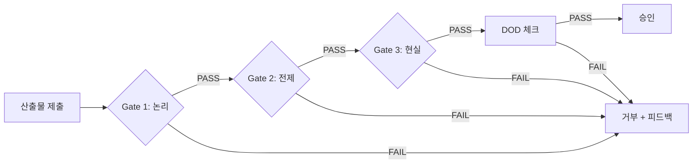

# Quality Gates

> DOD (Definition of Done) 및 검증 게이트

---

## 핵심 원칙

> [!IMPORTANT]
> **"완료는 '작동함'이 아니라 '검증됨'이다"**

모든 산출물은 Quality Gates 통과 없이 완료 선언 불가.

---

## 1. 3-Layer Quality Model

```
┌─────────────────────────────────────┐
│ Layer 1: 논리 검증 (Logic)           │
│ - 추론 과정이 타당한가?               │
└─────────────────────────────────────┘
┌─────────────────────────────────────┐
│ Layer 2: 전제 신뢰성 (Premise)       │
│ - 사용된 근거가 신뢰할 수 있는가?      │
└─────────────────────────────────────┘
┌─────────────────────────────────────┐
│ Layer 3: 현실 일관성 (Reality)       │
│ - 현실 세계와 모순이 없는가?          │
└─────────────────────────────────────┘
```

> 출처: `docs/09 - 3-Layer Deductive Verification`

---

## 2. Gate 1: 논리 검증 (Logic Verification)

### 2.1 검증 대상
- 추론 과정
- 인과 관계
- 결론 도출

### 2.2 검증 항목
- [ ] **타당성**: A → B → C 흐름이 논리적으로 타당한가?
- [ ] **완전성**: 누락된 전제가 없는가?
- [ ] **순환 논증**: 결론이 전제를 증명하는가?
- [ ] **논리적 비약**: 중간 단계 생략이 있는가?

### 2.3 통과 기준
```yaml
logic_check:
  - valid_inference: true
  - no_missing_premise: true
  - no_circular_reasoning: true
  - no_logical_leap: true
```

### 2.4 실패 시 처리
- 추론 과정 재작성
- 누락 전제 보완
- Reviewer 재검토

---

## 3. Gate 2: 전제 신뢰성 (Premise Reliability)

### 3.1 검증 대상
- 사용된 데이터
- 인용된 출처
- 전문가 의견

### 3.2 신뢰도 등급

| 등급 | 설명 | 예시 | 신뢰도 |
|------|------|------|--------|
| **L1: Observed** | 직접 관찰 | 실행 결과, 테스트 로그 | Level 5 |
| **L2: Verified** | 검증된 데이터 | 공식 문서, API 스펙 | Level 4 |
| **L3: Expert** | 전문가 의견 | 논문, 기술 블로그 (출처 명시) | Level 3 |
| **L4: Inferred** | 논리적 추론 | (전제 명시 필수) | Level 2 |
| **L5: Assumed** | 가정 | (비용으로 표시) | Level 1 |

### 3.3 통과 기준
```yaml
premise_check:
  - all_sources_cited: true
  - reliability_level: "L1 | L2 | L3"  # L4, L5는 경고
  - no_unverified_data: true
```

### 3.4 실패 시 처리
- 출처 보완
- 신뢰도 낮은 전제 교체
- 가정을 명시적으로 표시

---

## 4. Gate 3: 현실 일관성 (Reality Consistency)

### 4.1 검증 대상
- 물리적 제약
- 시간적 순서
- 자원 가능성

### 4.2 검증 항목
- [ ] **물리적 가능성**: 제안된 솔루션이 물리적으로 가능한가?
- [ ] **시간적 일관성**: 타임라인이 모순 없는가?
- [ ] **자원 현실성**: 필요 자원이 확보 가능한가?
- [ ] **기술적 실현성**: 현재 기술로 구현 가능한가?

### 4.3 통과 기준
```yaml
reality_check:
  - physically_possible: true
  - timeline_consistent: true
  - resources_available: true
  - technically_feasible: true
```

### 4.4 실패 시 처리
- 계획 수정
- 자원 재조정
- 대안 탐색

---

## 5. Definition of Done (DOD)

### 5.1 코드 DOD
- [ ] 모든 테스트 통과
- [ ] 코드 리뷰 승인
- [ ] Linter/Formatter 통과
- [ ] 문서화 완료 (README, API docs)
- [ ] 보안 취약점 없음
- [ ] 성능 기준 충족

### 5.2 문서 DOD
- [ ] 목적 명시
- [ ] 근거 포함
- [ ] 출처 표기
- [ ] Reviewer 승인
- [ ] 최신 정보 반영

### 5.3 계획 DOD
- [ ] WBS 완전성
- [ ] 의존성 해결
- [ ] 리스크 식별
- [ ] 타임라인 현실성
- [ ] 자원 확보 확인

---

## 6. 검증 프로세스



---

## 7. 검증 결과 포맷

```json
{
  "quality_gate_result": {
    "submission_id": "string",
    "gates": {
      "logic": {
        "status": "pass | fail",
        "findings": ["issue 1", "issue 2"]
      },
      "premise": {
        "status": "pass | fail",
        "reliability_levels": ["L1", "L2", "L3"]
      },
      "reality": {
        "status": "pass | fail",
        "constraints_violated": []
      }
    },
    "dod": {
      "status": "pass | fail",
      "missing_items": []
    },
    "overall": "approved | rejected | needs_revision",
    "reviewer": "agent_id",
    "timestamp": "ISO 8601"
  }
}
```

---

## 8. 조건부 통과 (Conditional Pass)

### 8.1 사용 조건
- Gate 통과했으나 minor 개선 필요
- 블로킹 이슈 없음

### 8.2 조건부 통과 포맷
```yaml
status: "conditional_pass"
conditions:
  - "성능 최적화 권장 (비차단)"
  - "문서 오타 수정 필요"
action: "다음 단계 진행 가능, 단 조건 이행 필수"
```

---

## 9. 거부 사유 카탈로그

| 거부 코드 | 설명 | 재제출 요구사항 |
|-----------|------|-----------------|
| **QG-L-001** | 논리적 비약 | 중간 단계 보완 |
| **QG-L-002** | 순환 논증 | 추론 구조 재설계 |
| **QG-P-001** | 출처 누락 | 모든 주장에 출처 추가 |
| **QG-P-002** | 신뢰도 부족 | L3 이상 출처 사용 |
| **QG-R-001** | 타임라인 모순 | 시간 순서 재정렬 |
| **QG-R-002** | 자원 부족 | 자원 확보 또는 축소 |

---

## 부록: 체크리스트 템플릿

### 코드 제출 체크리스트
```markdown
## Quality Gates Checklist

### Gate 1: 논리 검증
- [ ] 추론 과정 타당
- [ ] 전제 완전
- [ ] 순환 논증 없음

### Gate 2: 전제 신뢰성
- [ ] 모든 출처 명시
- [ ] 신뢰도 L3 이상

### Gate 3: 현실 일관성
- [ ] 기술적 실현 가능
- [ ] 자원 확보 가능

### DOD
- [ ] 테스트 통과
- [ ] 리뷰 승인
- [ ] 문서화 완료
```

---

> [!TIP]
> Quality Gates는 "장벽"이 아니라 **"안전망"**이다.
> 빠르게 실패하여 더 큰 실패를 막는다.
